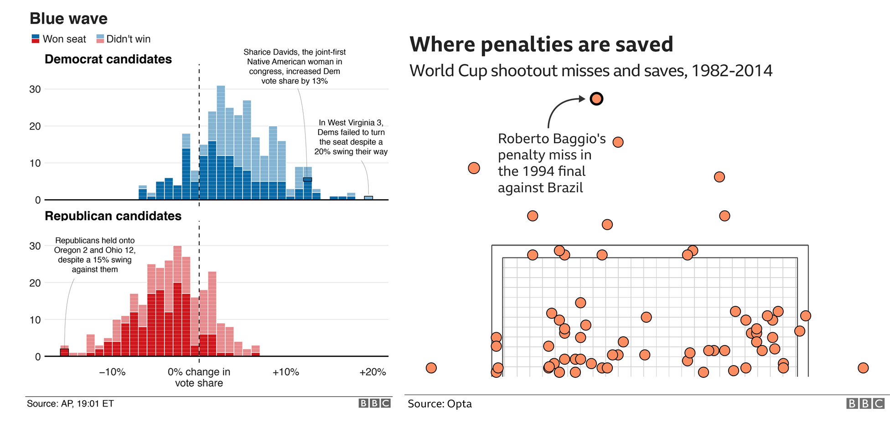

## BBPLOT

This repo contains the functions of the `bbplot` package, which once installed locally, provides helpful functions for creating and exporting  graphics made in ggplot in the style used by the BBC News data team.



## Installing bbplot

`bbplot` is not on CRAN, so you will have to install it directly from Github using `devtools`. 

If you do not have the `devtools` package installed, you will have to run the first line in the code below as well. 

```
# install.packages('devtools')
devtools::install_github('bbc/bbplot')
```

## Using the functions

The package has two functions for plots: `bbc_style()` and `finalise_plot`.

Detailed examples on how to use the functions included within the `bbplot` package to produce graphics are included in the [R cookbook](https://bbc.github.io/rcookbook/), as well as a more general reference manual for working with `ggplot2`.

A basic explanation and summary here:

### `bbc_style()`

1. `bbc_style()`: has no arguments and is added to the ggplot chain after you have created a plot. What it does is generally makes text size, font and colour, axis lines, axis text and many other standard chart components into BBC style, which has been formulated together with the Visual Journalism design team. 

The function is pretty basic and does not change or adapt based on the type of chart you are making, so in some cases you will need to make additional `theme` arguments in your ggplot chain if you want to make any additions or changes to the style, for example to add or remove gridlines etc. Also note that colours for lines in the case of a line chart or bars for a bar chart, do not come out of the box from the `bbc_style` function, but need to be explicitly set in your other standard `ggplot` chart functions.

Example of how it is used in a standard workflow:

```
line <- ggplot(line_df, aes(x = year, y = lifeExp)) +
geom_line(colour = "#007f7f", size = 1) +
geom_hline(yintercept = 0, size = 1, colour="#333333") +
bbc_style()
```
### `finalise_plot`

2. `finalise_plot`: will save out your plot with the correct guidelines for publication for a BBC News graphic. It is made up of functions that will left align your title, subtitle and source, add the BBC blocks at the bottom right and save it to your specified location. The function has six arguments, three of which need to be explicitly set and three that are defaults unless you overwrite them.  

Here are the function arguments:
`finalise_plot(plot_name, source_name, save_filepath, width_pixels, height_pixels, logo_image_path)`

* `plot_name`: the variable name that you have called your plot, for example for the chart example above `plot_name` would be `"line"`    
*  `source_name`: the source text that you want to appear at the bottom left corner of your plot. You will need to type the word `"Source:"`  before it, just the source, so for example `source = "Source: ONS"` would be the right way to do that.
* `save_filepath`: the precise filepath that you want your graphic to save to, including the `.png` extension at the end. This does depend on your working directory and if you are in a specific R project. An example of a relative filepath would be: `/charts/line_chart.png`.  
* `width_pixels`: this is set to 640px by default, so only call this argument and specify the width you want your chart to be. 
* `height_pixels`: this is set to 450px by default, so only call this argument and specify the height you want your chart to be. 
* `logo_image_path`: this argument specifies the path for the image/logo in the bottom right corner of the plot. The default is for a placeholder PNG file with a background that matches the background colour of the plot, so do not specify the argument if you want it to appear without a logo. If you want to add your own logo, just specify the path to your PNG file. The package has been prepared with a wide and thin image in mind. 

Example of how the `finalise_plot()` is used in a standard workflow. This function is called once you have created and finalised your chart data, titles and added the `bbc_style()` to it (see above):

```
finalise_plot(plot_name = my_line_plot,
source = "Source: ONS",
save_filepath = "filename_that_my_plot_should_be_saved_to-nc.png",
width_pixels = 640,
height_pixels = 550)
```
